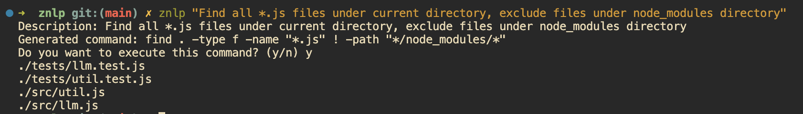
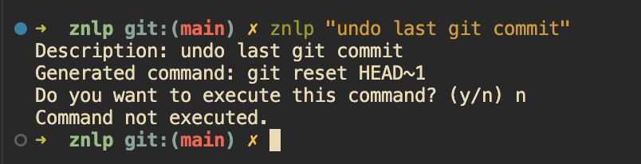

# znlp
A powerful node app that transforms natural language commands into executable bash commands. Simply describe what you want to do in plain English, and znlp will convert it into the corresponding shell command. Perfect for those moments when you can't remember the exact syntax or want a more intuitive way to interact with your terminal.
Works fully offline with Ollama!


[](LICENSE)


[](https://github.com/shambu2k/znlp/commits/main/)
[](https://github.com/shambu2k/znlp/issues)
[](https://github.com/shambu2k/znlp/pulls)


<!-- ## Table of Contents
- [Installation Instructions](#installation-instructions)
- [Usage](#usage)
- [Features](#features)
- [Screenshots](#screenshots)
- [Contributing](#contributing)
- [License](#license)
- [Acknowledgements](#acknowledgements)
- [Future Plans](#future-plans) -->

## Installation Instructions

Recommended: Node.js version 20

### Prerequisites
1. Install [ollama](https://ollama.com/download)
2. Pull the model:
```bash
ollama pull qwen2.5-coder:1.5b
```

### Setup
```bash
npm install -g znlp
```

## Usage
```bash
# Example
znlp "Find all *.js files under current directory, exclude files under node_modules directory"
```
This should generate a command and prompt you whether to execute that or not.

<!--
## Features
Highlight key features of the project.
- Feature 1
- Feature 2
- Feature 3 -->

## Screenshots



## Contributing
Link to the [CONTRIBUTING.md](CONTRIBUTING.md) file.

## License
This project is licensed under the MIT License - see the [LICENSE](LICENSE) file for details.

## Future Plans
- [x] push to npm
- [ ] Detect unsafe commands (`sudo rm -rf /`) and add fail safe
- [ ] Support OpenAI/Claude/Gemini/Mistral models through API
- [ ] Remove llm.js dependency

## Discussions
Join our community discussions at [GitHub Discussions](https://github.com/shambu2k/znlp/discussions/) to:
- Ask questions and get help
- Share your use cases and tips
- Suggest new features
- Connect with other users

We value your feedback and contributions!
